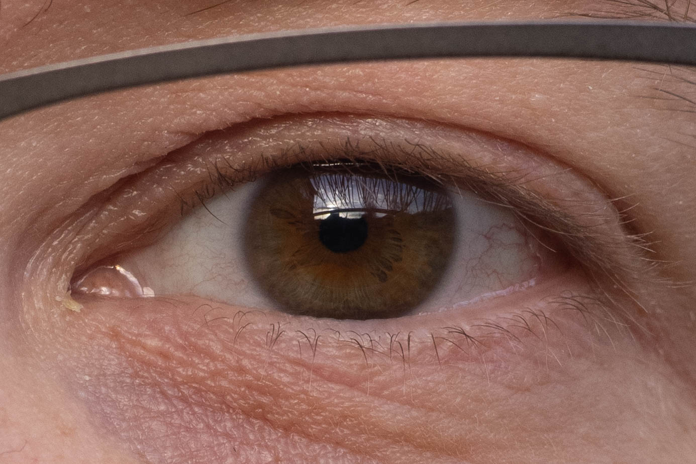
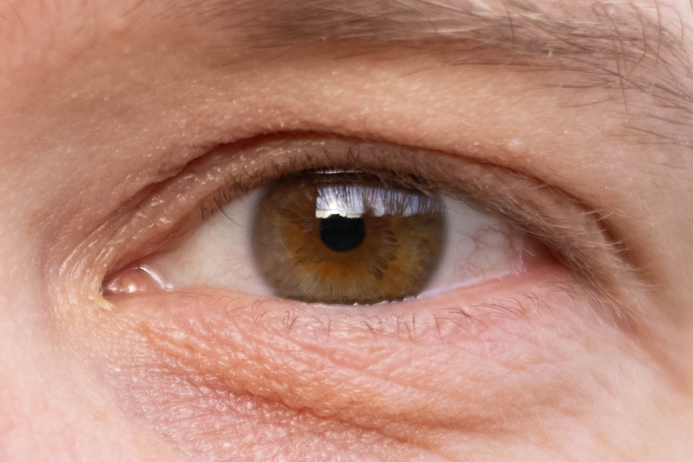
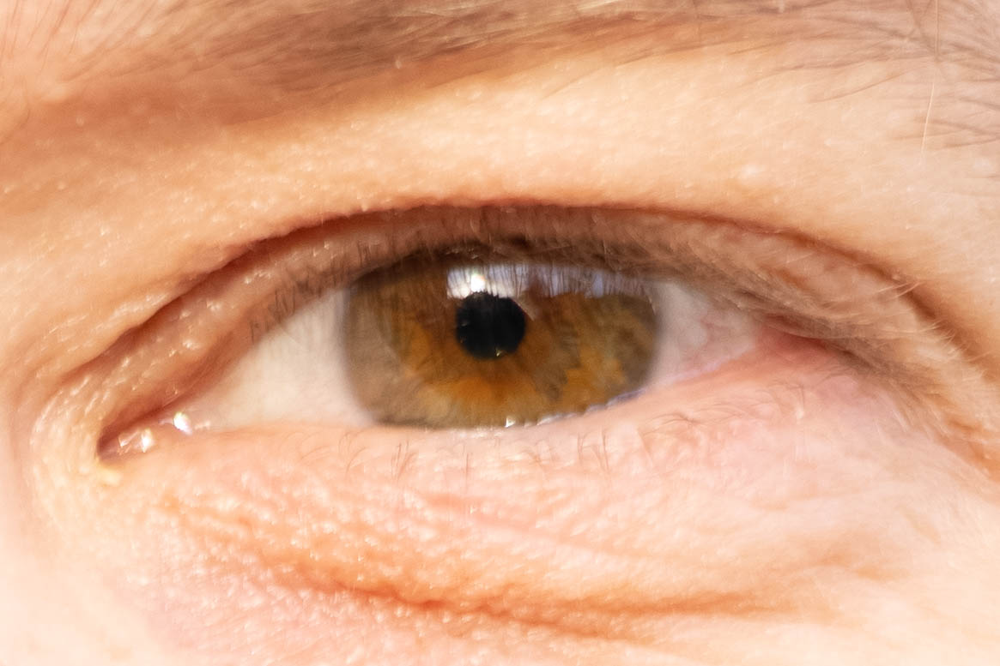

# Canon EOS R5 Eye Tracking Performance

I recently upgraded from a Canon EOS 5D mk3 to a Canon EOS R5. I love to take portraits and sharp focus on the eyes is critical. If I have filled the frame with a face then I expect to see details in the iris.

My method using the 5D mk3 is spot focus, cross type points only, 1/125th second shutter or faster and no movement (recomposing) after focusing. I found I could get away with recomposing the image after focusing using a 5D mk3 but not using a 5Ds r. I also found the 5Ds r needed a faster shutter speed for consistent sharpness.

My initial experience with R5 eye tracking was disappointing. The focus on the eye was not as sharp or as consistent as I had expected. This ran contrary to the the reviews of the camera I had seen which universally praised eye tracking so I decided to investigate.

Using a tripod and a remote shutter cable I turned the camera on myself. The tripod ensured the camera did not move and I kept as still as I could whilst focusing and taking the photos. I set the AF operation to servo AF and changed

* AF method
  * Face tracking with human eye detection
  * Spot
* Aperture
  * f2.8
  * f8
* Lens
  * Canon RF 50mm f1.8 STM
  * Canon EF 24-70mm f2.8L II USM @ 50mm

I faced into the evening sun to give plenty of light. I set the shutter speed to 1/200th of a second or faster. The ISO was set to auto and ranged between 100 and 640. I took approximately 10 photos for each setting combination giving approximately 80 photos in general. I then reviewed each photo and rated the focus on my left eye (the focal point) either excellent, acceptable or unacceptable.

Here's an example I rated excellent; Spot, f8, STM

Here's an example I rated acceptable; Spot, f2.8, STM

Here's an example I rated unacceptable; Eye Tracking, f2.8, STM

The rating of photos is subjective specially the difference between excellent and acceptable.

## Conclusion

1. My £220 Canon RF 50mm f1.8 STM is consistently sharper than my £1800 Canon EF 24-70mm f2.8L II USM
1. Spot focus and eye tracking produce similar results at f8 with both lenses
1. Spot focus is sharper than eye tracking at lower f numbers. I don't think eye tracking is accurate enough to use at f2.8.
